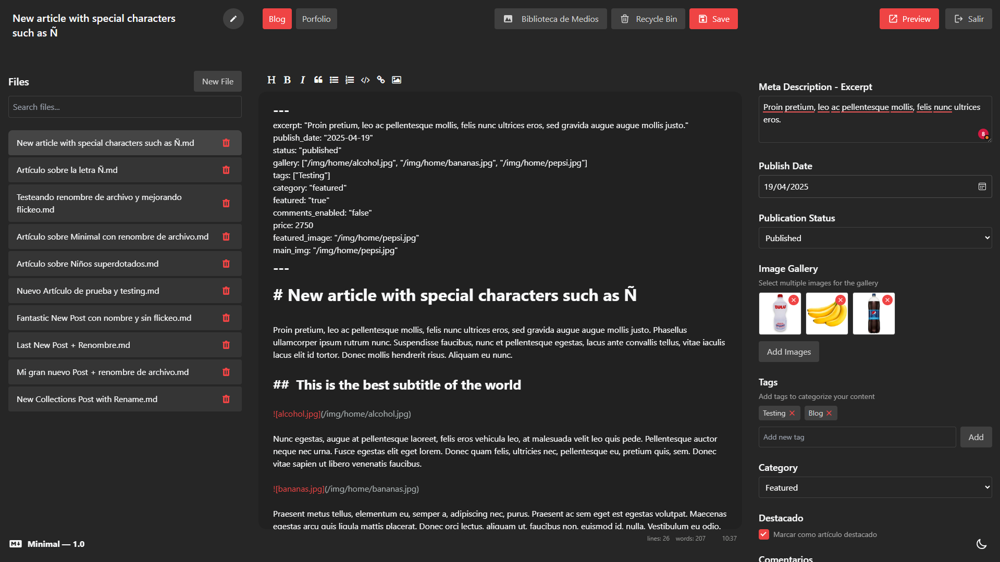

# Minimal CMS



A lightweight, file-based content management system designed for simplicity and flexibility.

**Developed by Nicolás González**

## Overview

Minimal CMS is a streamlined content management solution specifically designed for small-scale websites such as:
- Portfolios
- Small blogs
- Product showcases
- Simple listing sites

Unlike complex CMS platforms that require databases and extensive server configurations, Minimal CMS uses a file-based approach, making it easier to deploy, maintain, and back up.

## Key Features

- **No Database Required**: All content is stored in files, eliminating database dependencies
- **Collection-Based Structure**: Organize content into logical collections
- **Markdown Support**: Write content in Markdown for clean, semantic formatting
- **Custom Fields**: Define custom fields for each collection to structure your content
- **Simple Interface**: Clean, intuitive admin interface built with Tailwind CSS
- **Fast Performance**: Lightweight architecture ensures quick loading times
- **Responsive Design**: Looks great on devices of all sizes

## Collections

The heart of Minimal CMS is the collections system. Each collection is simply a folder within the `collections` directory. To create a new content type:

1. Create a folder in the `collections` directory (e.g., `blog`, `portfolio`, `products`)
2. Add a `fields.php` file to define your custom fields
3. Start adding content files to your collection

### Example Collection Structure

```
collections/
  ├── blog/
  │   ├── fields.php        # Field definitions
  │   ├── index.php         # Collection configuration
  │   ├── files/            # Content files
  │   └── recycle/          # Deleted items
  ├── portfolio/
  │   ├── fields.php
  │   ├── index.php
  │   ├── files/
  │   └── recycle/
  └── products/
      ├── fields.php
      ├── index.php
      ├── files/
      └── recycle/
```

## Markdown Benefits

Minimal CMS leverages Markdown for content creation, providing several advantages:

1. **Simplicity**: Easy-to-learn syntax that focuses on content, not formatting
2. **Portability**: Markdown files can be used outside the CMS if needed
3. **Version Control Friendly**: Easy to track changes in Git or other version control systems
4. **Future-Proof**: Plain text ensures content will be accessible regardless of future technology changes
5. **Lightweight**: Minimal bandwidth and storage requirements
6. **Clean Content Structure**: Separation of content and presentation

The CMS uses SimpleMDE for a user-friendly editing experience with previews, formatting tools, and syntax highlighting.

## Custom Fields

Each collection can define its own custom fields in the `fields.php` file. This allows you to create structured content specific to each collection's needs.

### Available Field Types

- **Text**: Single-line text input
- **Textarea**: Multi-line text area
- **Editor**: Markdown editor (SimpleMDE)
- **Select**: Dropdown selection with configurable options
- **Checkbox**: True/false toggle
- **Date**: Date picker with formatting options
- **Number**: Numeric input with optional min, max, and step attributes
- **Image**: Single image selection with preview
- **Gallery**: Multiple image selection
- **Tags**: Tag input field for categorization

### Field Configuration

Fields are defined in the `fields.php` file as an array of field configurations:

```php
return [
    // Text field example
    [
        'name' => 'title',          // Field identifier
        'label' => 'Title',         // Display label
        'location' => 'main',       // Field placement (main, right, left)
        'type' => 'text',           // Field type
        'description' => 'Post title', // Helper text
        'placeholder' => 'Enter title here' // Placeholder text (optional)
    ],
    
    // Textarea field example
    [
        'name' => 'excerpt',
        'label' => 'Excerpt',
        'location' => 'right',
        'type' => 'textarea',
        'description' => 'Short summary of the content'
    ],
    
    // Editor field example (SimpleMDE)
    [
        'name' => 'editor',
        'label' => '',
        'location' => 'main',
        'type' => 'editor'
    ],
    
    // Select field example
    [
        'name' => 'status',
        'label' => 'Publication Status',
        'location' => 'right',
        'type' => 'select',
        'default' => 'published',   // Default value (optional)
        'options' => [              // Available options as key-value pairs
            'draft' => 'Draft',
            'published' => 'Published',
            'archived' => 'Archived'
        ]
    ],
    
    // Checkbox field example
    [
        'name' => 'featured',
        'label' => 'Featured',
        'location' => 'right',
        'type' => 'checkbox',
        'default' => 'false',       // Default value (optional)
        'description' => 'Mark as featured content'
    ],
    
    // Date field example
    [
        'name' => 'publish_date',
        'label' => 'Publish Date',
        'location' => 'right',
        'type' => 'date',
        'format' => 'YYYY-MM-DD'    // Date format (optional)
    ],
    
    // Number field example
    [
        'name' => 'price',
        'label' => 'Price',
        'location' => 'right',
        'type' => 'number',
        'min' => 0,                 // Minimum value (optional)
        'max' => 999999,            // Maximum value (optional)
        'step' => 0.01,             // Step increment (optional, for decimal precision)
        'description' => 'Product price'
    ],
    
    // Image field example
    [
        'name' => 'featured_image',
        'label' => 'Featured Image',
        'location' => 'right',
        'type' => 'image',
        'description' => 'Select a single image for the post'
    ],
    
    // Gallery field example
    [
        'name' => 'gallery',
        'label' => 'Image Gallery',
        'location' => 'right',
        'type' => 'gallery',
        'description' => 'Select multiple images for the gallery'
    ],
    
    // Tags field example
    [
        'name' => 'tags',
        'label' => 'Tags',
        'location' => 'right',
        'type' => 'tags',
        'description' => 'Add tags to categorize your content'
    ]
];
```

### Field Locations

Fields can be positioned in different areas of the edit screen:
- `main`: Primary content area
- `right`: Right sidebar
- `left`: Left sidebar

### Hiding the SimpleMDE Editor

If you prefer to use only custom fields without the default Markdown editor, you can hide it by commenting out the editor field in your collection's `fields.php` file:

```php
// Comment out this block to hide the Markdown editor
/*
[
    'name' => 'editor',
    'label' => '',
    'location' => 'main',
    'type' => 'editor',
],
*/
```

## Technologies Used

Minimal CMS is built with modern, lightweight technologies:

### Languages Used
HTML, CSS, JavaScript and PHP

### [Tailwind CSS](https://tailwindcss.com/)
A utility-first CSS framework that allows for rapid UI development without leaving your HTML. Tailwind provides a clean, consistent design system for the admin interface.

### [SimpleMDE](https://simplemde.com/)
A simple, embeddable JavaScript Markdown editor with features like:
- Live preview
- Autosave
- Spell checker
- Keyboard shortcuts
- Syntax highlighting

### [Knock](https://github.com/jenstornell/knock#create-a-user)
A lightweight authentication library that provides secure user management without the need for a database.

## Installation Requirements

For Minimal CMS to function properly, you must follow these specific directory structure requirements:

1. **CMS Location**: The CMS software must be placed in a subdirectory named `content` within your main project(website). Example: /content.

2. **Media Library**: The media library must be located at `/public/img/` relative to your main project directory

Failure to maintain this directory structure will result in the CMS not working correctly.

## Getting Started

1. Clone or download the repository
2. Place the files in the `content` subdirectory of your web server (PHP required)
3. Ensure the `public/img` directories exist for the media library
4. Configure your site settings in `config.php`
5. Configure the `.htaccess` file, especially updating the CORS configuration with your specific domain (see Security Configuration below)
6. Create users in the `users` directory. Here is documentation: https://github.com/jenstornell/knock#create-a-user
7. Begin creating collections and adding content. You only have to duplicate the "demo" directory, inside the collections directory and rename it with the name of the new collection.

## Security Configuration

Minimal CMS requires proper `.htaccess` configuration to ensure both security and functionality. The included `.htaccess` file contains several important security measures:

### CORS Configuration

You must update the CORS configuration to specify which domains are allowed to make requests to your CMS:

```apache
# Basic CORS configuration
<IfModule mod_headers.c>
    # Allow specific origins (replace with your domain and development environments)
    SetEnvIf Origin "^(https://your-domain\.com|http://localhost|http://127\.0\.0\.1)" ALLOWED_ORIGIN=$1
    Header set Access-Control-Allow-Origin %{ALLOWED_ORIGIN}e env=ALLOWED_ORIGIN
    Header set Access-Control-Allow-Methods "GET, POST, OPTIONS" env=ALLOWED_ORIGIN
    Header set Access-Control-Allow-Headers "Origin, X-Requested-With, Content-Type, Accept" env=ALLOWED_ORIGIN
</IfModule>
```

Replace `your-domain\.com` with your actual domain name. This prevents cross-origin requests from unauthorized domains.

### Additional Security Measures

The `.htaccess` file also includes:

- Protection against common web attacks
- Basic XSS protection
- MIME type sniffing prevention
- Protection against clickjacking
- Directory listing prevention
- File inclusion attack prevention

These measures help secure your CMS while allowing the SimpleMDE editor to function properly.

## Best Practices

- Create a clear content structure with well-named collections
- Use custom fields to ensure consistent content formatting
- Leverage Markdown for content that needs formatting
- Use the built-in file organization to keep your content well-structured
- Regularly backup your content files

## Limitations

Minimal CMS is intentionally simple and may not be suitable for:
- Large websites with thousands of content items
- Complex applications requiring advanced user permissions
- Sites needing real-time content updates or complex search functionality

## License

This project is licensed under the MIT License - see the [LICENSE](LICENSE) file for details.

## Conclusion

Minimal CMS provides a streamlined approach to content management for small websites where simplicity, performance, and ease of use are priorities. Its file-based architecture and collection system make it perfect for developers who want a lightweight solution without the overhead of larger CMS platforms.
